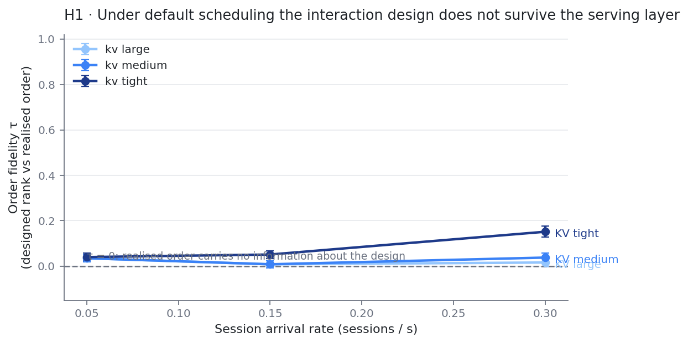
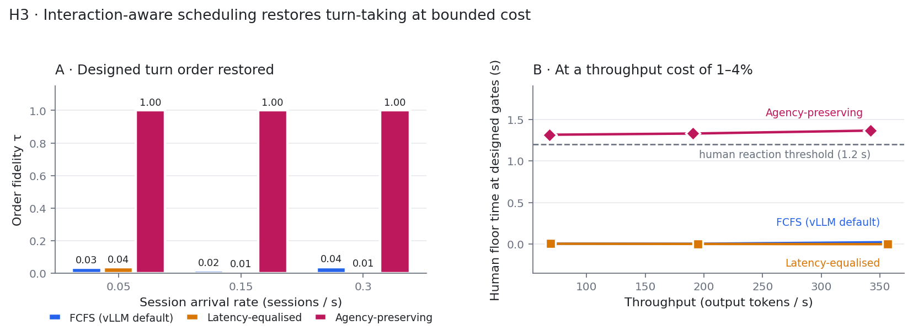

# The Scheduler Is an Interaction Designer

**Do LLM serving mechanics decide who holds the initiative in mixed-initiative human–AI teams?**

A reproducible benchmark and reference implementation for studying how KV-cache
state, continuous batching and preemption in an LLM serving engine shape the
*realised* turn order of a multi-agent system — and whether that order can be
brought back under the control of the interaction design.

---

## The question

Mixed-initiative visual analytics systems interleave a human with several
software agents. The interaction design specifies a **turn order**: the Analyst
speaks, the human has a moment to react, then the Critic responds to what the
human did. That order is load-bearing — it is what gives the human a place to
intervene.

But the design only *dispatches* the turns. Which agent actually starts
answering first is decided one layer down, by the serving engine, on the basis
of prefix-cache residency, queue position, batch composition and preemption
policy. None of those are interaction-design decisions, and nobody in the
mixed-initiative literature has measured what they do to turn-taking.

So: **the scheduler is making interaction-design decisions, invisibly.** This
repository measures how large that effect is and whether it can be controlled.

## Hypotheses

| | Claim | Tested here |
|---|---|---|
| **H1** | Under default scheduling (FCFS admission, LIFO preemption — vLLM's behaviour, which mixed-initiative systems inherit by not choosing otherwise), realised first-token order carries no information about the designed turn order, and the human's intervention window closes far faster than human reaction time. | **Yes** |
| **H2** | Restoring turn order changes human agency, trust calibration and intervention behaviour — and latency *variance* matters more than latency *mean*. | **No — requires a user study.** See *Scope and honest limits*. |
| **H3** | An interaction-aware scheduler restores order fidelity and reopens the intervention window at a throughput cost small enough to be worth paying. | **Yes** |

Each is falsifiable. H1 fails if τ is reliably high with an interval excluding
zero; H3 fails if the throughput cost is large.

## Findings

Averaged over 108 runs per hypothesis (12 seeds × 3 arrival rates × 3 KV pool
sizes; bootstrap intervals over sessions, the independent unit).

**H1 — the design does not survive the serving layer.**

| Measure | Result |
|---|---|
| Order fidelity τ (designed rank vs realised order) | **0.04**, 95% CI **[−0.05, 0.13]** — indistinguishable from zero |
| Rounds where designed order was not realised | **99%** (random-permutation baseline for 4 agents: 95.8%) |
| Rounds where ≥2 agents emitted a first token in the *same* engine step | **95%** |
| Human floor time at designed gates | **0.02 s** against a 1.2 s reaction threshold |

The design is not merely reordered — under batched prefill it is **flattened**:
the agents speak simultaneously and the human gets no turn at all.

A counterintuitive secondary result: order fidelity *rises* under KV pressure
(τ = 0.36 at the tightest pool and highest load, with 8.8 preemptions per
turn), because memory scarcity serialises the round. Scarcity partially
restores the interaction design that abundance destroys.

**H3 — it can be fixed cheaply.**

| Policy | τ | Human floor time | Displaced gates | Mean TTFT | Throughput |
|---|---|---|---|---|---|
| FCFS (vLLM default) | 0.03 | 0.01 s | 100% | 0.44 s | 206.8 tok/s |
| Latency-equalised | 0.02 | 0.00 s | 100% | 0.40 s | 206.8 tok/s |
| **Agency-preserving** | **1.00** | **1.34 s** | **0%** | 1.53 s | 200.4 tok/s (**−3.1%**) |

Note the middle row. Being *cache-aware* is not enough: a policy that equalises
latency without knowing the interaction design fixes nothing. The information
that matters is design intent, not timing.

## Interactive explorer

`viz/index.html` is a self-contained page that makes the serving layer visible: one row
per interaction round, one dot per agent, placed at the moment that agent starts
speaking. Under the default policy the dots pile on top of one another — the agents
answer in the same engine step and the human never gets a turn. Switch to the
agency-preserving policy and the same rounds become a staircase.

Open it locally (no server needed):

```bash
python -m mias.experiments.make_viz_data   # -> results/viz_data.json
python tools/build_viz.py                  # -> viz/index.html
```

The page is why this matters as an interaction problem rather than a systems one: if
the claim is that scheduling decisions are invisible to interaction designers, then
making them visible is part of the contribution.




## Scope and honest limits

**Read this before citing anything above.**

1. **The results above are simulated; a measured path is included and tested.**
   The engine here is a faithful reference model of vLLM's *mechanics* —
   block-paged KV allocation, chained block hashes for prefix matching,
   refcounted copy-on-write sharing, LRU eviction, continuous batching with
   chunked prefill, LIFO preemption — but step timing follows a two-parameter
   linear model whose constants are **placeholders**.
   `notebooks/colab_t4_measurement.ipynb` runs the identical workload against
   a real vLLM server on a free Colab T4, fits those constants, and measures
   turn order on hardware. The client that does it (`mias/measure.py`) is
   covered by nine tests against a mock server, so the code is exercised even
   without a GPU — but **no GPU run has been performed yet**, and until
   `results/measured_t4.csv` exists in this repository, every number in the
   tables above should be read as *mechanism behaves this way under this
   model*, not as *measured on hardware*.
2. **H2 is untested.** Nothing here involves a human participant. The
   interaction measures (`initiative_displacement`, `gate_gap_seconds`) are
   mechanical proxies for agency, not measurements of it. Whether restoring
   turn order changes what a human does is the study this instrumentation
   exists to enable, and it is the part that needs HCI methodology, not more
   simulation.
3. **The 1.2 s reaction threshold is a parameter, not a finding.** It is
   exposed as `gate_threshold` everywhere precisely because its right value is
   an empirical question.
4. **Workload is synthetic.** Agent personas, prompt lengths and session
   structure are modelled on a four-agent mixed-initiative analytics loop, not
   drawn from traces. Persona lengths are deliberately near-identical so that
   inversions cannot be an artefact of "short prompts prefill first".
5. **Results are sensitive to dispatch behaviour.** With zero fan-out jitter
   (strictly ordered dispatch) the effect weakens. That control is included as
   a condition rather than hidden, and the trade-off it implies — sequential
   dispatch preserves order but discards parallelism — is the reason an
   interaction-aware scheduler is worth having at all.

## Install and reproduce

```bash
git clone https://github.com/SyedaRubbani/mias-bench && cd mias-bench
python -m venv .venv && source .venv/bin/activate
pip install -r requirements.txt

./run_all.sh          # 49 tests, both experiments, both figures (~3 min, CPU only)
```

Or step by step:

```bash
python -m unittest discover -s tests -v       # 49 tests
python -m mias.experiments.h1_order_fidelity  # -> results/h1_order_fidelity.csv
python -m mias.experiments.h3_policy_tradeoff # -> results/h3_policy_tradeoff.csv
python -m mias.experiments.make_figures       # -> results/figures/*.png
```

Everything is seeded and deterministic: the same command produces byte-identical
CSVs. Both figures are regenerated from the shipped CSVs alone, so a reviewer
can reproduce every panel without rerunning a simulation.

Against a real engine — a free Colab T4 is enough. Two cells:

```python
!pip install -q vllm aiohttp
!git clone -q https://github.com/SyedaRubbani/mias-bench.git
%cd mias-bench
```
```python
!python scripts/run_t4.py --smoke     # ~3 min, proves the path end to end
!python scripts/run_t4.py             # ~30 min, the real run
```

`scripts/run_t4.py` probes which CLI flags this vLLM build accepts, launches
the server, calibrates the step-cost constants, measures three dispatch modes
across two KV-pool conditions, and writes `results/measured_t4.csv`,
`calibration_t4.json` and `provenance_t4.json`. `notebooks/colab_t4_measurement.ipynb`
does the same thing cell by cell if you prefer to step through it.

The T4 caveats are real and are stated in both: Turing has no bfloat16, so the
server runs `--dtype half` and falls back from FlashAttention; the model is
small, so absolute latencies are not comparable to an A100 deployment; and
Colab does not permit locking GPU clocks, so report medians and interquartile
ranges over repeats, never a single mean. What transfers across hardware is
the *ordering* effect, not the absolute timings.

Locally, if you already have a server on `:8000`:

```bash
python -c "
import asyncio
from mias.measure import build_rounds, run_measurement
from mias.metrics import summarise
r = build_rounds(n_sessions=6)
t, d = asyncio.run(run_measurement('http://localhost:8000', '<model>', r))
print(summarise(t))"
```

## Layout

```
mias/
  kv.py                     block-paged allocator, chained block hashes,
                            refcounted COW prefix cache, LRU eviction
  engine.py                 continuous batching, chunked prefill, LIFO
                            preemption, discrete-event loop
  policies.py               FCFS / LatencyEqualised / AgencyPreserving
  workload.py               mixed-initiative multi-agent session generator
  provenance.py             JSONL schema joining serving + interaction events
  metrics.py                order fidelity, initiative displacement, gate gap,
                            TTFT distribution, bootstrap CIs over sessions
  measure.py                live client: fires rounds against a real vLLM
                            server, three dispatch modes, calibration
  harness.py                condition runner and CSV writer
  experiments/              h1_order_fidelity, h3_policy_tradeoff, make_figures,
                            make_viz_data
notebooks/
  colab_t4_measurement.ipynb   end-to-end GPU measurement on a free Colab T4
viz/                        self-contained interactive provenance explorer
scripts/run_t4.py           single-command GPU run (probe, calibrate, measure)
tools/build_viz.py          inlines the data into the explorer
tools/build_notebook.py     generates the notebook (kept in sync by a test)
tests/
  test_mias.py              20 tests: allocator invariants, metric edge cases,
                            determinism, causality, policy behaviour
  test_measure.py           12 tests: live client against a mock vLLM server,
                            plus the run_t4 entry point
  test_notebook.py          13 tests: notebook validity, T4 flags, setup
                            failure modes, generator sync
results/                    CSVs, a sample provenance log, figures
```

## Serving provenance

The piece most likely to be useful on its own. Mixed-initiative systems already
log *interaction* provenance — what the human did, when, and what the agents
said. That log cannot explain why agent B answered before agent A, because the
cause is one layer down.

`mias/provenance.py` emits a flat JSONL stream in the same shape as an
interaction provenance log, joinable on `(session_id, round_idx, t)`:

```json
{"schema":"1.0","event":"turn_admitted","t":4.231,"turn_id":37,"session_id":4,
 "round_idx":1,"agent":"critic","designed_rank":1,"human_gate_before":true,
 "prompt_tokens":2093,"output_tokens":151,"cached_blocks":118,
 "computed_blocks":13,"kv_utilisation":0.62}
```

Events: `turn_arrived`, `turn_admitted`, `first_token`, `turn_preempted`,
`turn_finished`. A worked example is in `results/h1_provenance_sample.jsonl`.
Loadable with `pandas.read_json(path, lines=True)` by someone who has never
seen this code.

## Extending it

- **A different interaction design** — edit `DEFAULT_AGENTS` in `workload.py`;
  `designed_rank` and `human_gate_before` are all a policy sees.
- **A new policy** — subclass `Policy` in `policies.py` (three methods:
  `order_waiting`, `admissible`, `preemption_victim`) and register it in
  `POLICIES`. The engine and metrics need no changes.
- **A new outcome measure** — add it to `metrics.py`; `bootstrap_ci` takes any
  callable over a turn sequence and resamples sessions.
- **Real traces** — replace `WorkloadGenerator.generate` with a trace loader
  that yields `Session` objects.

## Citing

See `CITATION.cff`. Released under the MIT licence.

## Related work this positions against

Serving-side, on end-to-end latency for agentic workloads: Parrot (Lin et al.,
OSDI 2024), Autellix (Luo et al., 2025), TokenCake, Kairos, HexAGenT. All treat
the human as absent and optimise throughput or program completion time.

Interaction-side, on mixed-initiative multi-agent collaboration: MIVAIS (Stähle
et al., 2026), and the agency/interaction/adaptation framework of Holter &
El-Assady (2024). All treat the serving engine as a black-box API.

The gap between them is the whole of this repository: **the serving layer is
already making interaction-design decisions, and neither literature is looking.**
